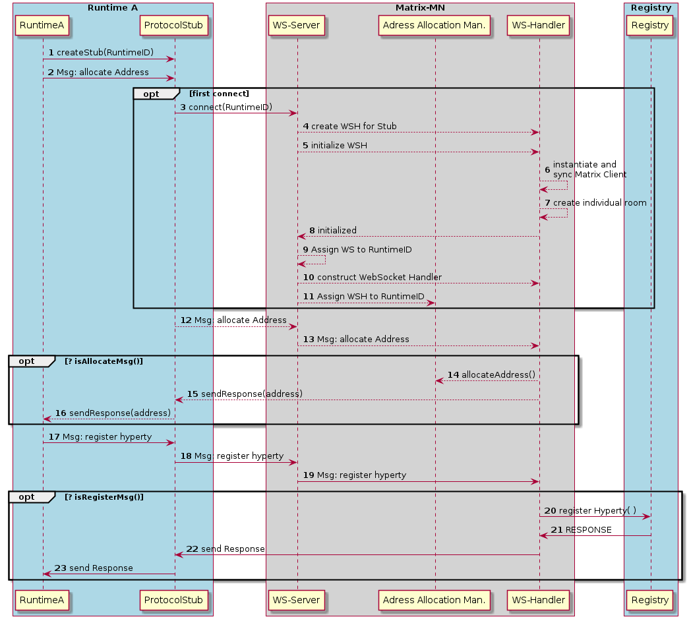
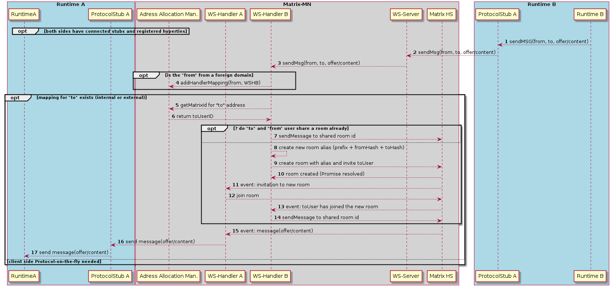

### Matrix.org based Messging Node
The repository for the Matrix.org based message node.
The MN code does not modify any Matrix.org specific code. It only adds componentes "around" an untouched Matrix Homeserver (HS).

#### Matrix.org - Overview and core concepts
The Matrix mission statement (from [matrix.org spec](http://www.matrix.org/)[??]):
> *The end goal of Matrix is to be a ubiquitous messaging layer for synchronising arbitrary data between sets of people, devices and services - be that for instant messages, VoIP call setups, or any other objects that need to be reliably and persistently pushed from A to B in an interoperable and federated manner.*

##### Homeservers
The core components of the Matrix architecture are the Home Servers (HS). Each Homeserver is responsible for one domain. Each client connects to one HS, wich is responsible for the own domain. Communication between different domains is supported by built-in federation mechanisms that sync and maintain the history of shared communication sessions among the domains. Home Servers use normal DNS to find, resolve and contact each other. The Federation API between Homeservers is based on HTTPs and therefore encrypted and secured by default.

The reference implementation of a Matrix HS, called *Synapse*, is written in Python and available on GitHub [Synapse](https://github.com/matrix-org/synapse)[??].

##### Clients

Matrix clients connect to a HomeServer by using a REST-based  [Client-Server-API](https://matrix.org/docs/api/client-server/)[??]. Clients can either implement the corresponding REST calls directly or choose to use one of the SDK's, which are available for a lot of different systems and programming languages, including Android, IOS, Python, NodeJS etc.
These SDK's abstract the REST API and provide a lot of high-level convenience methods.

Following picture shows the main data flow in a federated matrix architecture.

As this Figure shows, clients just connect to their own HS, but due to the built-in federation between the Homeservers they can communicate with Matrix clients from other domains just out-of-the-box. This allows to form a Matrix Eco-System, just by adding Homeservers to the public Internet and make their domains resolvable via DNS.

##### The Matrix Room concept

The Matrix.org project was influenced by concepts from traditional Instant Messaging systems. This can be seen especially in the concept of "communication rooms", which behave like a chat room. This concept implies that *every* communication requires a room. Even for a single message from one client to a dedicated receiver a room must be created first and the receiver must have joined this room in order to  receive this message.
Rooms are persistent. They can be re-entered after successive login sessions.

##### Application services

An Application Service is an implementation of a special service function that can be attached to a Homeserver. Based on certain patterns, messages are filtered and forwarded to the Application Service that performs application specific tasks. This concept is quite comparable to Application Servers in the IP Multimedia Subsystem (IMS) framework. It can, for example, be used for aggregation and accounting purposes, but also for the implementation of "breakout" communication to other types of messaging infrastructures it fits well.

Like the corresponding concept in IMS, also Matrix Application Services operate in a special trust-relationship with the HS. This trusted state allows them to listen to messages that match special user-/or room-name patterns as well as to create users on-the-fly and to operate on behalf of them.  
It must be noted that Application services do (until now) only play a passive role. They can listen to messages, but they can (by-design) not block or modify them.

#### Messaging Node implementation

##### General considerations, requirements and decisions

Matrix.org is a very vital and active project with frequent releases and new surrounding developments and projects. However, the provided API's are rather stable and as seen so far backward compatible. For that reason the first and most important decision for the design of the Matrix based messaging node was made:
- Don't touch the core of the Homeserver implementation! Just implement components that use standard API's to add the required functionalities!

If the reTHINK concepts of Protocol Stubs and Messaging Nodes are translated to the Matrix.org concepts, it seems like the Stubs map well to Matrix clients and the Messaging Nodes to Matrix Homeservers.

As described above, a Matrix client communicates to a Homeserver via a REST protocol. Several available SDKs encapsulate this protocol, so that - at the end - it is not obvious for the implementor of a client, when and how much traffic is generated between client and HS. Furthermore the SDKs come with a set of dependencies that potentially blow up the size of a Stub and make its deployment more complicated.

For these reasons it was decided that:
- The stub should be kept as small and simple as possible to ensure easy deployment.
- The real Matrix REST communication should be limited to the Messaging Node internally while the communication protocol between Stub and Messaging Node can be implemented differently.

Another challenge is that Matrix.org requires provisioned users and established room relationships between them to perform a communication. The establishment of a room relationship between two users is a process that requires several round-trip message exchanges between their corresponding clients. This process can take potentially too long and might lead to unacceptable delays for an ad-hoc message exchange between two Runtimes. Furthermore this would produce a lot of persistent room relationships in the Matrix Homeservers which might never be re-used again.

Therefore following requirements for the design of the Matrix based Messaging Node were identified:
- The Messaging node must support an automatic provisioning of Matrix users on-the-fly.
- The message routing must not depend on fully established room relationships between the matrix users that correspond with the "from" and "to" addresses of a retHINK message.

These 5 decisions led to the architecture that is described in the following section.

##### Matrix Messaging Node architecture
##### Matrix Messaging Stub
##### Dynamic Views

TODO: some explaining text ...

TODO: some explaining text ...

### Configuration and Operation
#### Initialization and Configuration of the MatrixMN

#### Setting up a docker image for the Matrix MN
#### Operation instructions
#### Execution of the Testcases
